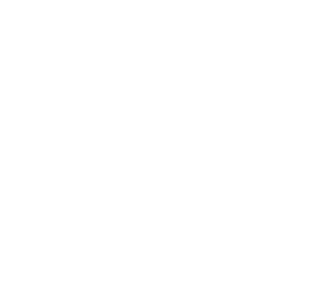

# E.Y.E. - Sign Language to Speech Translator



## 📋 Overview

E.Y.E. (Enhance Your Expression) is an innovative application that bridges communication gaps by translating sign language gestures into spoken words in real-time. Using computer vision and machine learning techniques, E.Y.E. detects hand gestures through a webcam, interprets them as sign language, and converts them to speech, making communication more accessible for the deaf and hard of hearing community.

## ✨ Features

- **Real-time Sign Language Detection**: Captures and interprets sign language gestures through your webcam
- **Text-to-Speech Conversion**: Converts recognized signs into audible speech
- **Gesture Collection**: Builds sentences by collecting multiple gestures before speaking
- **Bidirectional Translation**: Includes Text-to-Sign translation feature (accessible via the ✨ button)
- **User-friendly Interface**: Simple, intuitive controls for starting, stopping, and resetting detection

## 🛠️ Technology Stack

### Frontend
- **React.js**: For building the user interface
- **Axios**: For making HTTP requests to the backend
- **CSS Modules**: For component-specific styling

### Backend
- **Flask**: Python web framework for the backend API
- **TensorFlow**: For running the gesture recognition model
- **MediaPipe**: For hand tracking and gesture detection
- **OpenCV**: For webcam capture and image processing
- **pyttsx3**: For text-to-speech conversion

### Machine Learning
- **TensorFlow Lite Task Library**: For running the pre-trained gesture recognition model
- **Custom-trained Gesture Recognizer**: Trained on sign language datasets (not included in repository)

## 📊 Project Structure

```
.
├── frontend/
│   ├── src/
│   │   ├── App.jsx                # Main application component
│   │   ├── App.css                # Main styles
│   │   ├── GestureControl.jsx     # Component for gesture control interface
│   │   ├── gc.module.css          # Styles for gesture control
│   │   ├── index.css              # Global CSS styles
│   │   ├── main.jsx               # Entry point for React app
│   │   └── assets/
│   │       └── logo.png           # Project logo
│   └── ...
├── backend/
│   ├── app.py                     # Flask server with API endpoints
│   ├── detect.py                  # Standalone script for gesture detection
│   ├── detect1.py                 # Enhanced version with additional features
│   └── exported_model/
│       └── gesture_recognizer.task  # Pre-trained gesture recognition model (not included in repo)
└── ...
```

## 🚀 Installation

### Prerequisites
- Python 3.8+
- Node.js and npm
- Webcam
- Git

### Backend Setup
1. Clone the repository:
```bash
git clone https://github.com/yourusername/eye-project.git
cd eye-project
```

2. Create and activate a virtual environment:
```bash
python -m venv venv
source venv/bin/activate  # On Windows: venv\Scripts\activate
```

3. Install Python dependencies:
```bash
pip install flask flask-cors opencv-python tensorflow mediapipe pyttsx3
```

4. Ensure you have the gesture recognition model in the correct location:
```
backend/exported_model/gesture_recognizer.task
```

5. Start the Flask server:
```bash
cd backend
python app.py
```

### Frontend Setup
1. Install Node.js dependencies:
```bash
cd frontend
npm install
```

2. Start the development server:
```bash
npm run dev
```

3. Open your browser and navigate to the URL shown in the terminal (typically http://localhost:5173)

## 💻 Usage

1. Launch both the backend server and frontend application
2. Click "Start Detection" to begin capturing gestures from your webcam
3. Make sign language gestures and hold them for approximately 3 seconds to register
4. Click "Fetch Gestures" to see the recognized gestures
5. Click "Speak Gestures" to hear the detected signs spoken aloud
6. Click "Reset" to clear the current gesture sequence
7. Click the "✨" button to switch to Text-to-Sign translation mode

## 🤝 Contributing

Contributions are welcome! Please feel free to submit a Pull Request.

1. Fork the repository
2. Create your feature branch (`git checkout -b feature/amazing-feature`)
3. Commit your changes (`git commit -m 'Add some amazing feature'`)
4. Push to the branch (`git push origin feature/amazing-feature`)
5. Open a Pull Request

## 👥 Authors/Contributors

- Maryum Urooj (@maryumurooj)
- Yasir Hussain (@yasir027)
- Uzma Begum
- Adil Shaik

## 🙏 Acknowledgements

- MediaPipe team for their gesture recognition framework
- TensorFlow team for their machine learning tools
- All contributors who have helped with the project

## 📞 Contact

If you have any questions or feedback, please reach out at maryum.urooj05@gmail.com or open an issue on GitHub.
